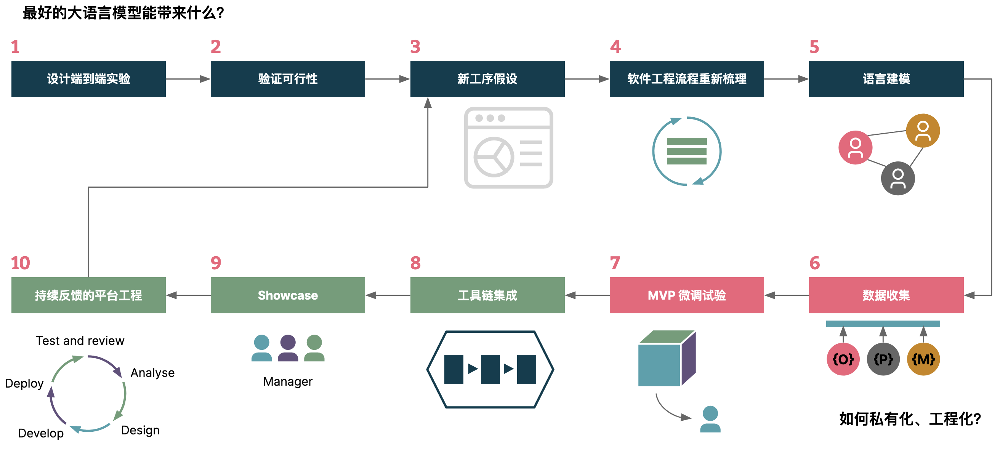
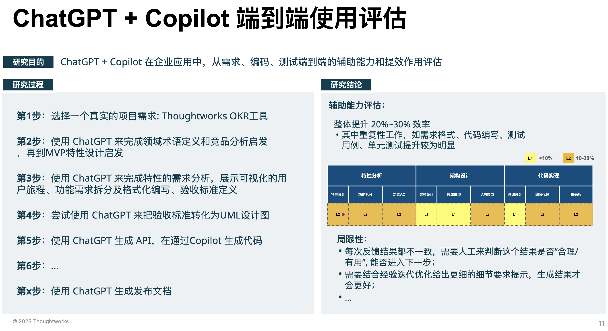
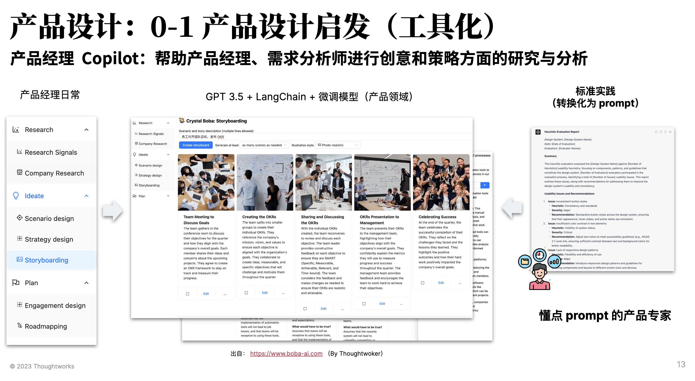
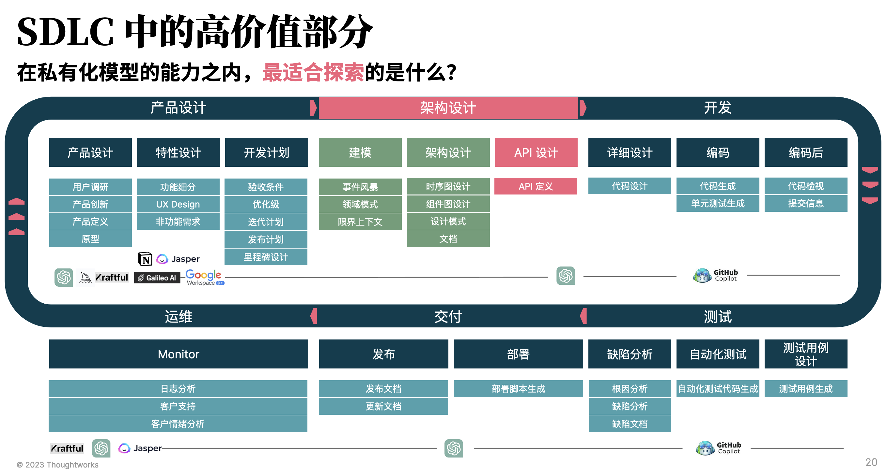
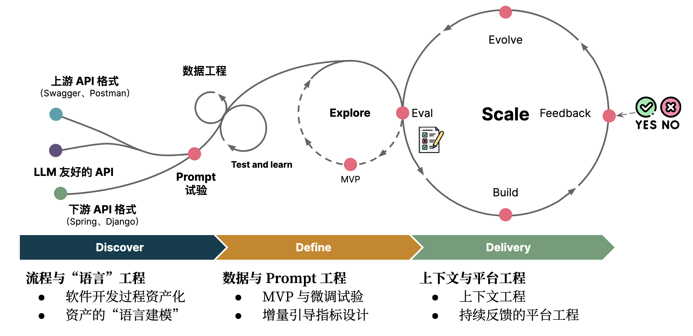
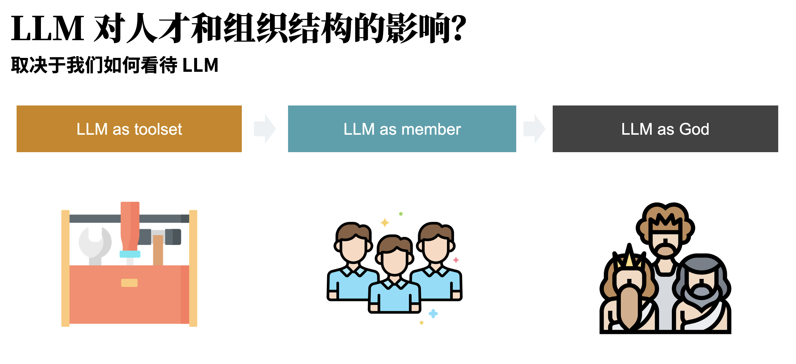

# ****LLM 赋能的研发效能：如何探索软件开发新工序？****

上周末，我们在 QCon 广州 2023 上分享了一个 AI 结合**研发效能**的话题：《探索软件开发新工序：LLM 赋能研发效能提升》 。我们分享了：Thoughtworks 在过去的两个月里对于 LLM （大语言模型）结合软件开发的一些探索。

在这篇文章里，我们将总结一些关键的要素，方便于大家理解。后续，等后续的录屏版本出来后，也可以再回顾一下。值得注意的是，当前我们处于**探索** + 尝试落地的阶段，更多的是围绕于我们的过程和如何构建。总体思路如下：

Slides 和相关问题可以在这里一起讨论：[https://github.com/unit-mesh/conf](https://github.com/unit-mesh/conf)

## 企业适合何种 AIGC 投资策略？

在过去的几个月里，有大量的 KOL 都在说：所有的应用都可以用 AI 重写一遍。而落地到现有的 DevOps 工具里，假设都需要重写，那么未来的架构可能是怎样的？

于是，我们根据我们的理解将应用分成了四种类型：

1. AI 端到端应用。即直接面向最终用户的应用（含专有模型），诸如 ChatGPT、Midjourney
2. 应用 + 闭源基础模型。如基于 OpenAI、文心一言（他们提供了吗，我没收到）等 API 来构建应用。
3. 应用 + 专有模型。即基于开源基础模型，或者自有的模型，来构建端到端应用。
4. 应用 + 微调模型。基于开源模型 + 面向自己研发场景下来微调，以构建领域特定的应用。

不同的企业，应该根据自身的情况（安全、隐私等等），来调整自己的投资策略。

而随着时间的演讲，也会出现越来越多的新场景，带来不同的变化。

## AI 研发效能：最好的大语言模型带来什么？

今天（**2022.05.29**），市面上已经有一系列结合 LLM 的研发效能工具，从产品设计、架构设计等，直到运维运营等等。基于人工智能的工具与基础大语言模型可以增强软件开发在设计、需求、测试、发布和运维等各个环节中的能力，提高质量和效率。

但是，这些工具往往是破碎、割裂的，还可能并不适合我们现有的研发流程。所以，从我们的经验出发，需要从研发流程出发，将每个工序拆到足够的小，才能构建出明显的效果。

随后，基于我们选择的工具来进行评估，如我们示例中基于的是 ChatGPT、GitHub Copilot 来做评估，随后记录对应的提升效果，以及局限性等等：

而对于那些可以公开的信息，不涉及企业内部的数据，则可以直接开发对应的工具。如我们同事开发的产品经理的 AI 辅助工具：

其基于 GPT 3.5 + LangChain + Thoughtworks 产品领域相关的知识库构建的。

而虽然生成式 AI 技术及工具已经在软件生命周期的各个环节中体现出了提效的可行性，但想要在大型科技组织中端到端落地、实现提效的突破，还面临很多挑战：

1. **企业规模化软件过程提效的挑战**
    1. **信息安全和信创化的强制要求**
    2. **开源大模型表现偏弱、自己训练成本高**
    3. 难**与企业内部工具进行结合**
2. **开发 AI 辅助研发提效的局限性**
    1. **基于 GPT 模型的工具不符合信息安全要求**
    2. **公开LLM 针对专业领域表现不佳，适用性差**
    3. **LLM 工具碎片化**

大部分企业尚在探索过程中，于是我们产生了两个假设：

- **假设 1**：每个大型企业都将有私有化的大语言模型
- **假设 2：**私有化的主流方式：开源 LLM + 微调

随后，我们继续探索基于开源 LLM、私有化场景下的新工序。

## AI 研发效能：从问题出发摸索新工序

在探索时，作为工程专家而非大语言模型专家的我们，遇到一系列的挑战、需要解决各种各样的困惑。我们的探索过程分为了三个阶段，每个阶段都需要探索不同的问题：

1. 阶段一：微调与研发过程如何结合？
    1. 现有的开源模型能满足需求吗？
    2. 合理的指令（输入和输出）应该是怎样的？
    3. 微调的成本和工作量在哪？
2. 阶段二：工具设计和整合？
    1. 产品形态应该是怎样的？（聊天、交互式）
    2. 与现有工具对比竞争力在哪？（端到端？）
    3. 工具是否需要重写一遍？
3. 分析成功 AI 产品
    1. 如何高效构建上下文？（2K）
    2. 如何提升速度？（缓存、减少请求）
    3. 如何提升准确率/接受率？

而如果要探索，那么我们还需要考虑的是：哪部分是最有价值的。比如说，从我的日常业务场景出发，架构设计是我们更高价值的场景：

而其中的一个环境就是 API 设计（RESTful API 设计）。

## AI 研发效能：如何工程化落地？

于是呢，我们基于我们的 API 总结了一个基本的工序化构建方式，如下图所示：

简单来说，就是三个阶段六个工程：

- 软件开发过程资产化。需要注意的是：基于私有化 LLM 的新工序一部分取决于已有的软件过程资产，诸如架构模型、UML 等。
- 资产的“语言建模”。探索适合于大语言模型的资产代码化形式。
- MVP 与微调试验。对已有数据进行标准化，生成指令格式数据集（反复多次），并结合 LLM 需要设计 instruction。
- 增量引导指标设计。诸如于 HumanEval 的手写高质量测试数据集，来作为分阶段的微调目标：如 5%，10% 等。
- 上下文工程。如何在 Token 限制的场景下，提供尽可能丰富的上下文，如 GitHub Copilot 是 6 个人在半年内开发的，在本地计算 token 花费了大量的时间（详见：《[上下文工程](https://www.phodal.com/blog/llm-context-engineering/)》 。因此，上下文的构建应该被当作是一个工程、策略，而不是一个简单的事情。
- 持续反馈的平台工程。与已有工具集成，构建起自动调优闭环，持续收集数据和反馈。

更详细的示例，可以参考：《[大语言模型友好的 API：借助集体智慧构建更好的软件架构](https://www.phodal.com/blog/llm-friendly-api/)》

## 未来展望：如何应对 LLM 带来的挑战？

从我们的角度来看，未来 LLM 将会被集成到 BizDevOps 的工具链中，以端到端的方式提升效能。

而对于组织来说，我们还需要考虑一个问题：

不同的方式，决定了我们如何使用 LLM。随着大模型不断的发展，成熟度提升，我们多了一个超级队友。当 Ta 掌握了所有的知识和技能，ta 可能就变成了一个上帝（当然，这不会是几年内能发生的事情）。
